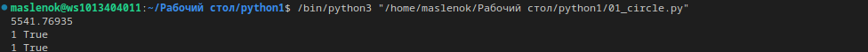
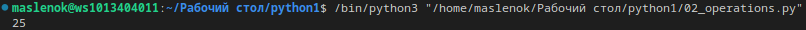
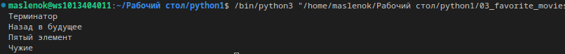
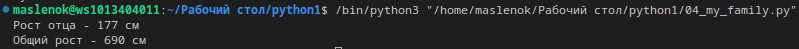
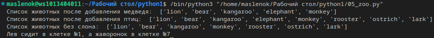
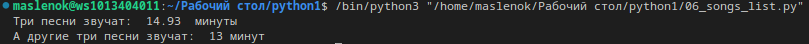
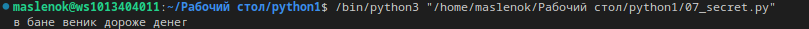
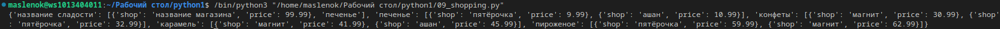
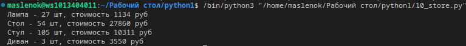

# Отчёт по лабораторной работе №1

## Задание №1
Составить словарь словарей расстояний между городами, используя формулу: 
$distances = \sqrt{((x_1 - x_2) ^ 2 + (y_1 - y_2) ^ 2)}$
## Результат вычислений: 

## Задание №2
1) Для начала нужно вывести на консоль значение площади круга с точностью до 4-х знаков после запятой 
Формула для нахождения площади круга: $S_к = R^2 * \pi$
2) Даны координаты точки, если точка лежит внутри того самого круга [центр в начале координат (0, 0), radius = 42], то вывести на консоль True/False, если точка лежит вовне круга.
## Результат вычислений:

## Задание №3
Расставить знаки операций "+", "-", "*", "/" и скобки между числами "1 2 3 4 5" так, что бы получилось число "25".
## Результат вычислений:

## Задание №4
Есть строка с перечислением фильмов: 'Терминатор, Пятый элемент, Аватар, Чужие, Назад в будущее'. 
Нужно вывести на консоль с помощью индексации строки, последовательно: первый фильм, последний, второй, второй с конца.
## Результат вычислений:

## Задание №5
Нужно создать список семьи и их роста, вывести рост отца и общий рост семьи.
## Результат вычислений:

## Задание №6
Есть список животных в зоопарке: 'lion', 'kangaroo', 'elephant', 'monkey'. Нужно сделать:
1) Посадить медведя между львом и кенгуру;
2) Добавить птиц в зоопарк;
3) Убрать слона;
4) Узнать в какой клетке сидит лев и жаворонок.
## Результат вычислений:

## Задание №7
Дан список песен группы Depeche Mode, распечатать общее время звучания трех песен: 'Halo', 'Enjoy the Silence', 'Clean' в формате "Три песни звучат ХХХ.ХХ минут", вывести общее время звучания других трёх песен: 'Sweetest Perfection', 'Policy of Truth', 'Blue Dress' в формате "А другие три звучат ХХХ минут"
## Результат вычислений:

## Задание №8
Дано зашифрованное сообщение, необходимо его расшифровать и вывести на консоль
* Ключ к расшифровке:
первое слово - 4-я буква
второе слово - буквы с 10 по 13, включительно
третье слово - буквы с 6 по 15, включительно, через одну
четвертое слово - буквы с 8 по 13, включительно, в обратном порядке
пятое слово - буквы с 17 по 21, включительно, в обратном порядке
## Результат вычислений: 

## Задание №9
Даны луг и сад, необходимо узнать:
1) Какие цветы растут и там, и там
2) Какие цветы растут в саду, но не растут в лугу
3) Какие цветы растут на лугу, но не растут в саду
## Результат вычислений:

## Задание №10
Дан словарь магазинов с распродажами, нужно создать словарь цен на продукты следующего вида.
## Результат вычислений:

## Задание №11
Дан словарь кодов товаров и словарь списка количества товаров на складе, нужно рассчитать на какую сумму лежит каждого товара на складе.
## Результат вычислений:

# Список использованных источников: 
1) [Подробная информация об обратных срезах](https://clck.ru/MfEMS)
2) [Функция round](https://docs.python.org/3/search.html?q=round)

# Шпаргалка по работе с командами git:
* git add - добавление файлов в индекс;
* git status - проверка статуса репозитория;
* git push - отправка изменений в удаленный репозиторий;
* git restote - отмена изменений;
* git commit - добавление файлов в репозиторий.
